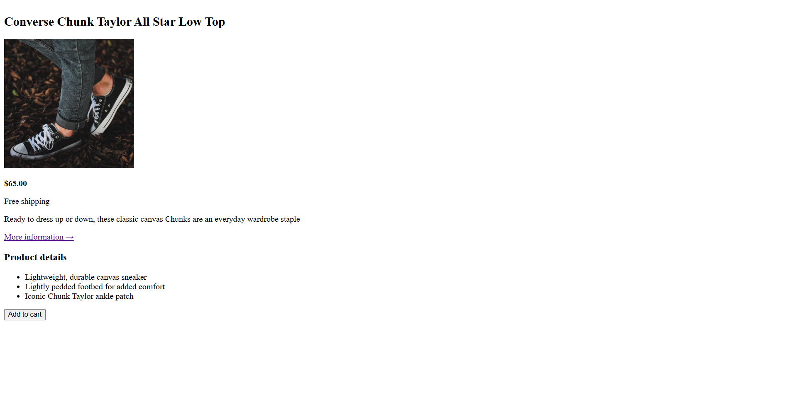

# Web Development Journey 2026

Welcome to my coding log! This repository serves as a documentation of my journey from learning the fundamentals of web development to building real-world projects.

## 🚀 Goals

- [x] Master HTML5 & CSS3 ✅ (in progress)
- [ ] Learn JavaScript fundamentals
- [ ] Understand responsive web design
- [ ] Build and deploy professional projects

## 📂 Projects

Here are the projects I have built during my journey:

- **[Code Magazine](code-magazine/)**: ✅ Completed - A semantic HTML structure project now styled with CSS (fonts, colors, typography).
- **[Product Page](product-page/)**: ✅ Completed - A product page for Converse Chuck Taylor sneakers built with HTML structure, lists, images, and links.

## 📅 Progress Log

| Date       | Topic/Module      | Key Concepts Learned                                             |
| :--------- | :---------------- | :-------------------------------------------------------------- |
| 2026-07-03 | CSS Basics        | Styling fonts, colors, text transforms, line heights, and CSS reset |
| 2026-07-02 | Product Page      | HTML product layout, image integration, lists, and anchor links |
| 2026-06-30 | Code Magazine     | Project completion, Semantic structure, README polishing          |
| 2026-06-29 | Git Workflow      | Branching, renaming, staging (`git add`), and pushing to remote  |
| 2026-06-29 | Semantic HTML     | Structure (`header`, `main`, `footer`) vs Presentational tags    |
| 2026-06-29 | Documentation     | Creating `README.md`, image linking, and repo organization       |
| 2026-06-28 | HTML Basics       | Created index.html and added first content                       |
| 2026-06-28 | Environment Setup | Initialized GitHub repo, VS Code setup, Git workflow             |

## 🖼️ Project Previews

## 🛠 Tech Stack

- HTML5
- CSS3
- JavaScript *(coming soon)*

## 🔗 Live Portfolio

My deployed projects will be listed here.

## 📁 How to View These Projects

If you want to open any of these projects on your own computer:

1. **Download the repository**  
   - Click the green **"Code"** button on GitHub  
   - Select **"Download ZIP"**  
   - Extract the folder to your desktop

2. **Open the project folder**  
   - Navigate to the project you want to view (e.g., `code-magazine/` or `product-page/`)

3. **Open the HTML file**  
   - Double-click `index.html` — it will open automatically in your web browser

That's it! No special software or commands needed.