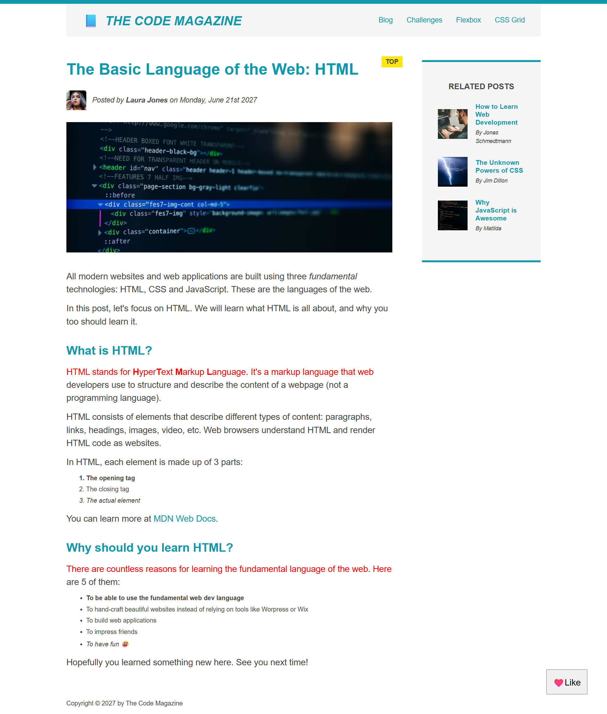
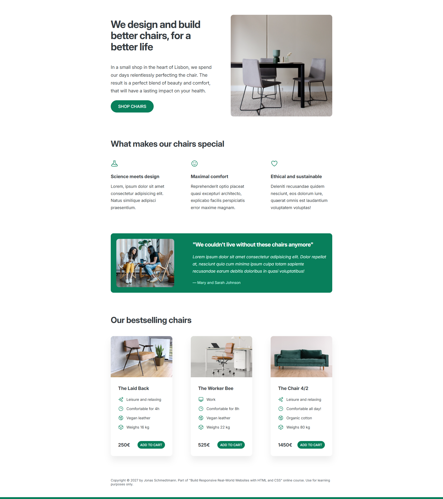

# Web Development Journey 2026

Welcome to my coding log! This repository serves as a documentation of my journey from learning the fundamentals of web development to building real-world projects.

## 🚀 Goals

- [x] Master HTML5 & CSS3 ✅
- [x] Build and deploy professional projects
- [ ] Understand responsive web design
- [ ] Learn JavaScript

## 📂 Projects

Here are the projects I have built during my journey:

- **[Code Magazine](code-magazine/)**: ✅ Completed - A semantic HTML structure project now fully styled with CSS (fonts, colors, typography, link states, body border, CSS Box Model, display property, positioning, pseudo-elements, float styling, box-sizing, flexbox, and CSS Grid).
- **[Product Page](product-page/)**: ✅ Completed - A product page for Converse Chuck Taylor sneakers with HTML structure and CSS styling (button hover effects, list styling, borders, link states, `cursor: pointer`, CSS Box Model, display property, positioning, pseudo-elements, float styling, a full flexbox rebuild, and a full CSS Grid rebuild).
- **[Furniture Page](furniture-page/)**: ✅ Completed - A design-focused landing page for a furniture brand, built to practice UI design (typography, color palettes, icons, white space, border radius, box shadows, and layout).

## 📅 Progress Log

| Date       | Topic/Module                 | Key Concepts Learned                                                                 |
| :--------- | :--------------------------- | :----------------------------------------------------------------------------------- |
| 2026-09-25 | UI Components (Accordion)    | Built a reusable accordion component using HTML and CSS — expand/collapse content sections with smooth transitions |
| 2026-09-24 | Furniture Page (Build)       | Completed a design-focused landing page; applied website personalities and ingredients — typography, color palettes, icons, white space, border radius, box shadows, and UI polish |
| 2026-09-23 | Furniture Page (Start)       | Started a design-focused landing page from scratch; practicing UI design principles — typography, color palettes, iconography, and layout balance |
| 2026-09-22 | CSS Grid (Product Page)      | Rebuilt the entire Product Page layout using CSS Grid; applied `display: grid;`, `grid-template-columns`, `grid-template-rows`, `gap`, `column-gap`, `row-gap`, `fr` unit, `repeat()`, `grid-column`, `grid-row`, `grid-area`, `justify-items`, and `align-items` for precise two-dimensional layout control |
| 2026-09-22 | CSS Grid (Code Magazine)     | Rebuilt the entire Code Magazine layout using CSS Grid; applied `display: grid;`, `grid-template-columns`, `grid-template-rows`, `gap`, `column-gap`, `row-gap`, `fr` unit, `repeat()`, `grid-column`, `grid-row`, `grid-area`, `justify-items`, and `align-items` for precise two-dimensional layout control |
| 2026-09-22 | CSS Grid (Practice)          | Created a practice file inside Code Magazine to learn CSS Grid syntax; practiced `display: grid;`, `grid-template-columns`, `grid-template-rows`, `gap`, `column-gap`, `row-gap`, `fr` unit, `repeat()`, `grid-column`, `grid-row`, `grid-area`, `justify-items`, `align-items`, and alignment properties |
| 2026-09-21 | CSS Flexbox (Product Page)   | Rebuilt the entire Product Page layout using flexbox; applied `display: flex;`, `flex-grow`, `flex-shrink`, `flex-basis`, `gap`, `align-items`, `align-self`, and `justify-content` (`center`, `flex-start`, `flex-end`, `space-between`, `space-around`) |
| 2026-09-21 | CSS Flexbox                  | Applied `display: flex;` to Code Magazine layout; used `flex-grow`, `flex-shrink`, `flex-basis`, `gap`, `align-items`, `align-self`, and `justify-content` (`center`, `flex-start`, `flex-end`, `space-between`, `space-around`) to build flexible, responsive component layouts |
| 2026-09-20 | Flexbox (Practice)           | Created a practice file inside Code Magazine to learn flexbox syntax basics before applying to the real project; experimenting with flex container properties |
| 2026-09-20 | CSS Float Challenge          | Completed challenge on Product Page — applied float layouts (`float: left;`, `float: right;`, clearfix, `clear: both;`, `display: flow-root;`) to restructure the entire product page layout |
| 2026-09-08 | CSS Box Sizing               | `box-sizing: border-box;` — ensures width and height include padding and border; prevents layout overflow when adding padding/border; applied via universal reset (`* { box-sizing: border-box; }`) to Code Magazine project |
| 2026-09-08 | CSS Float Styling            | `float: left;` and `float: right;` — pushing elements left or right; `clear: left;`, `clear: right;`, `clear: both;` — stopping elements from wrapping around floats; parent collapse problem; clearfix hack with `::after` and `clear: both`; `display: flow-root;` — modern fix for parent collapse; use cases: wrapping text around images, drop caps, old-school layouts; applied to Code Magazine project |
| 2026-08-27 | CSS Pseudo-elements & Challenge | Applied `::first-line`, `::first-letter`, `::before`, and `::after` to Product Page; completed challenge upgrading Product Page with pseudo-elements and advanced styling techniques |
| 2026-08-27 | CSS Pseudo-elements          | `::first-line` — styling the first line of text; `::first-letter` — styling the first letter; `::before` and `::after` — inserting content before/after elements using the `content` property; adjacent pseudo-elements; double colon syntax (`::`) vs single colon (`:`) for pseudo-classes |
| 2026-08-23 | CSS Display & Positioning    | Types of boxes: block-level, inline, and inline-block; `display` property (`block`, `inline`, `inline-block`); positioning modes: normal flow and absolute positioning; `position` property (`static`, `relative`, `absolute`, `fixed`); offset properties (`top`, `right`, `bottom`, `left`) |
| 2026-08-22 | CSS Box Model                | Content, border, padding, margin, fill area (background color/image); element dimensions (height & width); shorthand styling for margin and padding; collapsing margins; applied to both Code Magazine and Product Page projects |
| 2026-08-22 | CSS Challenge & Core Concepts | Styling product page with classes; `text-transform: uppercase`; `list-style: square`; borders; button hover effects (black → white background flip); `cursor: pointer`; link pseudo-classes (`:link`, `:visited`, `:hover`, `:active`); CSS inheritance (body styles inherited by children, overridden when needed); universal selector (`*`) for global resets |
| 2026-07-05 | CSS Selectors, Colors & DevTools | Element, class, and ID selectors; combining selectors; colors (hex, rgb, named); pseudo-classes (`:link`, `:visited`, `:hover`, `:active`); styling hyperlinks; Chrome DevTools inspection |
| 2026-07-03 | CSS Basics                   | Styling fonts, colors, text transforms, line heights, and CSS reset                 |
| 2026-07-02 | Product Page                 | HTML product layout, image integration, lists, and anchor links                     |
| 2026-06-30 | Code Magazine                | Project completion, Semantic structure, README polishing                            |
| 2026-06-29 | Git Workflow                 | Branching, renaming, staging (`git add`), and pushing to remote                     |
| 2026-06-29 | Semantic HTML                | Structure (`header`, `main`, `footer`) vs Presentational tags                       |
| 2026-06-29 | Documentation                | Creating `README.md`, image linking, and repo organization                          |
| 2026-06-28 | HTML Basics                  | Created index.html and added first content                                          |
| 2026-06-28 | Environment Setup            | Initialized GitHub repo, VS Code setup, Git workflow                                |

## 🖼️ Project Previews

## 🛠 Tech Stack

- HTML5
- CSS3
- JavaScript *(coming soon)*

## 🔗 Live Portfolio

My deployed projects will be listed here.

## 📁 How to View These Projects

If you want to open any of these projects on your own computer:

1. **Download the repository**  
   - Click the green **"Code"** button on GitHub  
   - Select **"Download ZIP"**  
   - Extract the folder to your desktop

2. **Open the project folder**  
   - Navigate to the project you want to view (e.g., `code-magazine/`, `product-page/`, or `furniture-page/`)

3. **Open the HTML file**  
   - Double-click `index.html` — it will open automatically in your web browser

That's it! No special software or commands needed.