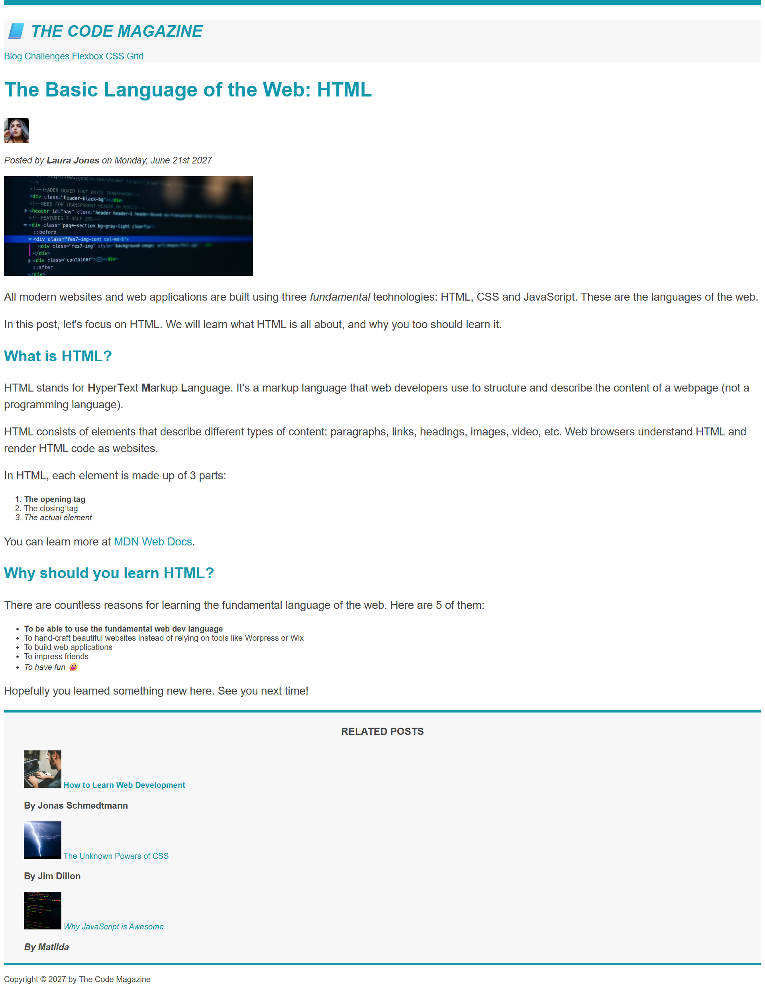

# 📘 The Code Magazine

Welcome to my first web development project! This project started as an HTML-only exercise and has now been enhanced with CSS styling.

## Project Description

The Code Magazine is a clean, semantic HTML layout with CSS styling for improved readability, visual appeal, and interactive link states.

## 🖼️ Project Preview

**Before CSS (HTML only):**

**After CSS (Styled):**

## Key Features

- **Semantic HTML5 Structure**: Uses `<header>`, `<article>`, `<aside>`, and `<footer>` tags for better accessibility and SEO.
- **Content Organization**: Implemented ordered and unordered lists, and proper heading hierarchy.
- **External & Internal Linking**: Includes navigation between pages and secure external links using `target="_blank"`.
- **Media**: Integrated images with descriptive `alt` tags.
- **CSS Styling**: Added fonts, colors, text transforms, spacing, pseudo-class-based link styling (`:link`, `:visited`, `:hover`, `:active`), and a top border on the body for visual structure.
- **Chrome DevTools**: Used for inspecting and debugging CSS styles.

## Technologies Used

- HTML5
- CSS3

## What I Learned

- Structuring a magazine-style layout with semantic HTML
- Using CSS for typography, colors, and spacing
- Styling link states with pseudo-classes (`:link`, `:visited`, `:hover`, `:active`)
- Applying borders to elements for visual hierarchy
- Understanding CSS inheritance (body styles inherited by children, but can be overridden)
- Using the universal selector (`*`) for global resets

## Project Status

✅ HTML structure complete  
✅ CSS styling added (fonts, colors, typography, link states, body border)  
⏳ Responsive design (coming soon)  
⏳ JavaScript interactivity (future)

## How to View

To view this project on your computer:

1. Download or clone this repository
2. Navigate to the `code-magazine/` folder
3. Double-click `index.html` — it will open in your browser

No special software or commands needed — just double-click and go!