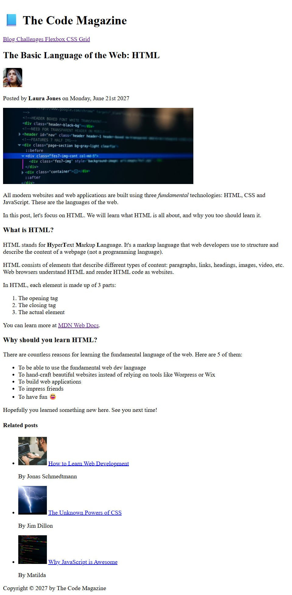

# 📘 The Code Magazine

Welcome to my first web development project! This project started as an HTML-only exercise and has now been enhanced with CSS styling.

## Project Description

The Code Magazine is a clean, semantic HTML layout with CSS styling for improved readability, visual appeal, interactive link states, and a solid understanding of the CSS Box Model, display property, positioning, and pseudo-elements.

## 🖼️ Project Preview

**Before CSS (HTML only):**

**After CSS (Styled):**

## Key Features

- **Semantic HTML5 Structure**: Uses `<header>`, `<article>`, `<aside>`, and `<footer>` tags for better accessibility and SEO.
- **Content Organization**: Implemented ordered and unordered lists, and proper heading hierarchy.
- **External & Internal Linking**: Includes navigation between pages and secure external links using `target="_blank"`.
- **Media**: Integrated images with descriptive `alt` tags.
- **CSS Styling**: Added fonts, colors, text transforms, spacing, pseudo-class-based link styling (`:link`, `:visited`, `:hover`, `:active`), and a top border on the body for visual structure.
- **CSS Box Model**: Applied padding, margin, borders, and dimensions to control spacing and layout.
- **CSS Display & Positioning**: Applied block, inline, and inline-block display properties; used normal flow and absolute positioning for layout control.
- **CSS Pseudo-elements**: Used `::first-line`, `::first-letter`, `::before`, and `::after` to style specific parts of elements and insert decorative content.
- **Chrome DevTools**: Used for inspecting and debugging CSS styles.

## Technologies Used

- HTML5
- CSS3

## What I Learned

- Structuring a magazine-style layout with semantic HTML
- Using CSS for typography, colors, and spacing
- Styling link states with pseudo-classes (`:link`, `:visited`, `:hover`, `:active`)
- Applying borders to elements for visual hierarchy
- Understanding CSS inheritance (body styles inherited by children, but can be overridden)
- Using the universal selector (`*`) for global resets
- **CSS Box Model**:
  - **Content** — the actual text or image inside an element
  - **Border** — the line wrapping around the padding/content
  - **Padding** — space between the content and the border (inside)
  - **Margin** — space outside the border (between elements)
  - **Fill Area** — background color or image covering the element
  - **Height & Width** — setting explicit dimensions for elements
  - **Shorthand Styling** — `margin: 10px 20px;` and `padding: 10px;`
  - **Collapsing Margins** — when vertical margins of adjacent elements combine into one
- **CSS Display Property**:
  - **Block-level boxes** — take full width, stack vertically (`
`, `<h1>`, `
`)
  - **Inline boxes** — only take needed width, sit next to each other (``, `<a>`)
  - **Inline-block boxes** — like inline but can have width/height/margin/padding
  - `display: block;` `display: inline;` `display: inline-block;`
- **CSS Positioning**:
  - **Normal Flow** — default layout where elements stack based on display type
  - **Absolute Positioning** — removes element from normal flow; positions relative to nearest positioned ancestor
  - **Position Property** — `static` (default), `relative`, `absolute`, `fixed`
  - **Offset Properties** — `top`, `right`, `bottom`, `left`
- **CSS Pseudo-elements**:
  - `::first-line` — styles the first line of a block of text
  - `::first-letter` — styles the first letter of a block of text
  - `::before` — inserts content before an element's content (using `content` property)
  - `::after` — inserts content after an element's content (using `content` property)
  - Adjacent pseudo-elements — using multiple pseudo-elements on the same selector
  - Double colon syntax (`::`) distinguishes pseudo-elements from pseudo-classes (`:`)

## Project Status

✅ HTML structure complete  
✅ CSS styling added (fonts, colors, typography, link states, body border)  
✅ CSS Box Model applied (padding, margin, borders, dimensions)  
✅ CSS Display & Positioning applied  
✅ CSS Pseudo-elements applied  
⏳ Responsive design (coming soon)  
⏳ JavaScript interactivity (future)

## How to View

To view this project on your computer:

1. Download or clone this repository
2. Navigate to the `code-magazine/` folder
3. Double-click `index.html` — it will open in your browser

No special software or commands needed — just double-click and go!