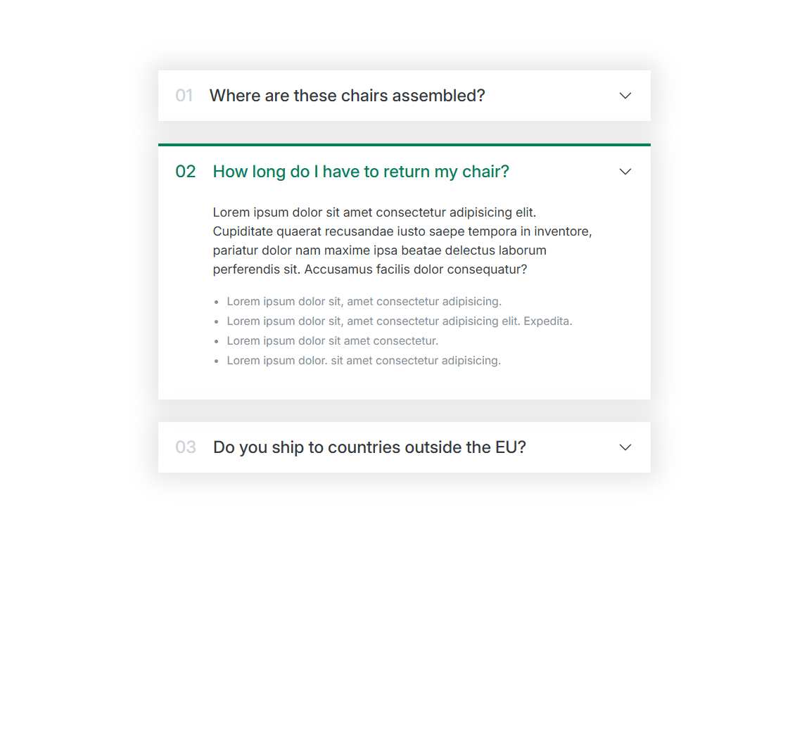

# 🧩 UI Components

A collection of reusable UI components built while learning modern front-end development.

## 📖 About

This folder contains practice builds focused on mastering reusable UI patterns used in real-world applications — accordions, carousels, tables, pagination, hero sections, and full web app layouts.

Each component is self-contained with its own HTML and CSS.

## 🧱 Components

### Accordion

### Carousel

*(Preview coming soon)*

### Table

*(Preview coming soon)*

### Pagination

*(Preview coming soon)*

### Hero Section

*(Preview coming soon)*

### Web App Layout

*(Preview coming soon)*

## 🛠 Built With

- HTML5
- CSS3

## 📁 How to View

1. Download or clone this repository
2. Navigate to any component folder (e.g., `components/accordion/`)
3. Double-click `index.html` — it will open in your browser

No special software or commands needed.

## 🎯 Purpose

These are practice builds — focused on learning how to structure and style reusable components that appear in real websites and applications.