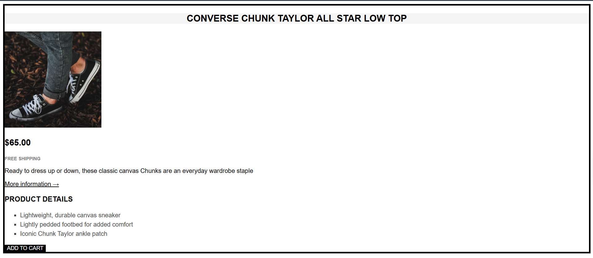

# 👟 Product Page - Converse Chuck Taylor

This is my second HTML project, now fully styled with CSS! Built as part of my web development learning journey.

## Project Description

A clean, semantic HTML product page for the Converse Chuck Taylor All Star Low Top sneakers — now enhanced with custom CSS styling, interactive hover states, and polished UI details.

## Key Features

- **Semantic HTML Structure**: Uses `<article>`, `<h2>`, `<h3>`, `
`, `<ul>`, and `<button>` for clean organization
- **Product Display**: Features product image with dimensions, pricing, and description
- **External Linking**: Includes a "More information" link that opens in a new tab (`target="_blank"`)
- **Product Details**: Unordered list highlighting key product features
- **CSS Styling**:
  - Custom button with hover effect (black background → white background flip)
  - `list-style: square` for product details
  - `text-transform: uppercase` for headings
  - Borders for structure and visual hierarchy
  - `cursor: pointer` on interactive elements
  - Link pseudo-classes (`:link`, `:visited`, `:hover`, `:active`)
- **Call-to-Action**: "Add to cart" button with hover interactivity

## Technologies Used

- HTML5
- CSS3

## What I Learned

- Structuring a product page with semantic HTML
- Using images with proper `alt` text and dimensions
- Creating external links with `target="_blank"` for better user experience
- Organizing product features using unordered lists
- Styling buttons with hover effects (background and text color flip)
- Using `list-style: square` for custom bullet points
- Applying `text-transform: uppercase` to headings
- Working with borders for visual structure
- Using `cursor: pointer` for better UX
- Styling link states with pseudo-classes (`:link`, `:visited`, `:hover`, `:active`)
- Understanding CSS inheritance (body styles inherited by children, but can be overridden)
- Using the universal selector (`*`) for global resets

## Project Status

✅ HTML structure complete  
✅ CSS styling added (layout, colors, typography, button, lists, borders, hover states)  
⏳ Responsive design (coming soon)  
⏳ JavaScript interactivity (future)

## Project Preview

## How to View

To view this project on your computer:

1. Download or clone this repository
2. Navigate to the `product-page/` folder
3. Double-click `index.html` — it will open in your browser

No special software or commands needed — just double-click and go!