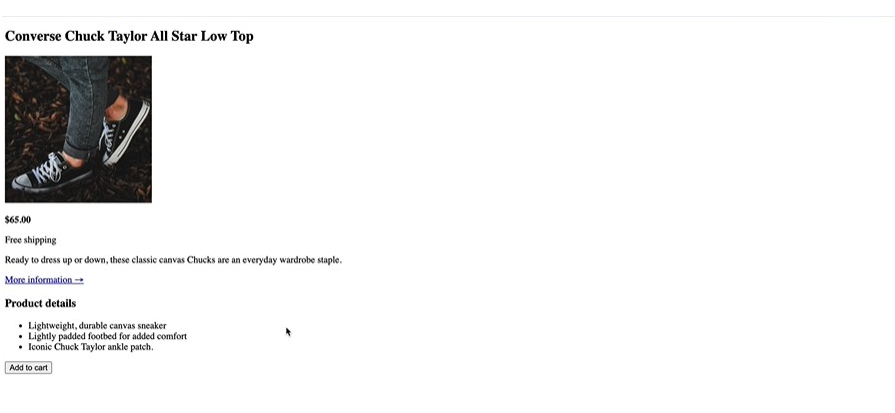

# 👟 Product Page - Converse Chuck Taylor

This is my second HTML project, now fully styled with CSS! Built as part of my web development learning journey, this project also served as a challenge to apply CSS Box Model concepts, pseudo-elements, float layouts, flexbox, and CSS Grid.

## Project Description

A clean, semantic HTML product page for the Converse Chuck Taylor All Star Low Top sneakers — now enhanced with custom CSS styling, interactive hover states, polished UI details, proper use of the CSS Box Model for layout and spacing, pseudo-elements for advanced styling, float layouts, a full flexbox rebuild, and a complete CSS Grid rebuild for precise two-dimensional layout control.

## Key Features

- **Semantic HTML Structure**: Uses `<article>`, `<h2>`, `<h3>`, `
`, `<ul>`, and `<button>` for clean organization
- **Product Display**: Features product image with dimensions, pricing, and description
- **External Linking**: Includes a "More information" link that opens in a new tab (`target="_blank"`)
- **Product Details**: Unordered list highlighting key product features
- **CSS Styling**:
  - Custom button with hover effect (black background → white background flip)
  - `list-style: square` for product details
  - `text-transform: uppercase` for headings
  - Borders for structure and visual hierarchy
  - `cursor: pointer` on interactive elements
  - Link pseudo-classes (`:link`, `:visited`, `:hover`, `:active`)
- **CSS Box Model**:
  - Padding and margin for spacing control
  - Borders for visual structure
  - Height and width for element dimensions
  - Background fill area with colors
  - Shorthand styling for efficient code
- **CSS Pseudo-elements**:
  - `::first-line` — styling the first line of text blocks
  - `::first-letter` — styling the first letter of text blocks
  - `::before` — inserting decorative content before elements
  - `::after` — inserting decorative content after elements
- **CSS Float Styling**:
  - `float: left;` and `float: right;` — pushing elements left or right
  - `clear: left;`, `clear: right;`, `clear: both;` — stopping elements from wrapping around floats
  - Parent collapse problem and clearfix hack (`::after` with `clear: both`)
  - `display: flow-root;` — modern fix for parent collapse
  - Used to restructure the product page layout
- **CSS Flexbox**:
  - `display: flex;` — modern one-dimensional layout
  - `flex-grow`, `flex-shrink`, `flex-basis` — flexible sizing of items
  - `gap` — spacing between flex items
  - `align-items`, `align-self` — cross-axis alignment
  - `justify-content` — main-axis alignment (`center`, `flex-start`, `flex-end`, `space-between`, `space-around`)
  - Rebuilt the entire product page layout using flexbox
- **CSS Grid**:
  - `display: grid;` — modern two-dimensional layout
  - `grid-template-columns`, `grid-template-rows` — defining track structure
  - `gap`, `row-gap`, `column-gap` — spacing between grid tracks
  - `fr` unit — fractional space distribution
  - `repeat()` — shorthand for repeating track patterns
  - `grid-column`, `grid-row`, `grid-area` — placing items on the grid
  - `justify-items`, `align-items` — alignment within grid cells
  - Rebuilt the entire product page layout using CSS Grid
- **Call-to-Action**: "Add to cart" button with hover interactivity

## Technologies Used

- HTML5
- CSS3

## What I Learned

- Structuring a product page with semantic HTML
- Using images with proper `alt` text and dimensions
- Creating external links with `target="_blank"` for better user experience
- Organizing product features using unordered lists
- Styling buttons with hover effects (background and text color flip)
- Using `list-style: square` for custom bullet points
- Applying `text-transform: uppercase` to headings
- Working with borders for visual structure
- Using `cursor: pointer` for better UX
- Styling link states with pseudo-classes (`:link`, `:visited`, `:hover`, `:active`)
- Understanding CSS inheritance (body styles inherited by children, but can be overridden)
- Using the universal selector (`*`) for global resets
- **CSS Box Model**:
  - **Content** — the actual text or image inside an element
  - **Border** — the line wrapping around the padding/content
  - **Padding** — space between the content and the border (inside)
  - **Margin** — space outside the border (between elements)
  - **Fill Area** — background color covering the element
  - **Height & Width** — setting explicit dimensions for elements
  - **Shorthand Styling** — `margin: 10px 20px;` and `padding: 10px;`
  - **Collapsing Margins** — when vertical margins of adjacent elements combine into one
- **CSS Pseudo-elements**:
  - `::first-line` — styles the first line of a block of text
  - `::first-letter` — styles the first letter of a block of text
  - `::before` — inserts content before an element's content (using `content` property)
  - `::after` — inserts content after an element's content (using `content` property)
  - Adjacent pseudo-elements — using multiple pseudo-elements on the same selector
  - Double colon syntax (`::`) distinguishes pseudo-elements from pseudo-classes (`:`)
  - `content` property — required for `::before` and `::after` to work
- **CSS Float Styling**:
  - `float: left;` and `float: right;` — pushing elements to the left or right
  - `clear: left;`, `clear: right;`, `clear: both;` — stopping elements from wrapping around floats
  - Parent collapse problem — what happens when a parent contains only floated children
  - Clearfix hack — using `::after` with `clear: both` to fix parent collapse
  - `display: flow-root;` — modern way to fix parent collapse
  - Use cases: wrapping text around images, drop caps, old-school layouts
  - Applied to restructure the product page layout
- **CSS Flexbox**:
  - `display: flex;` — turns an element into a flex container, enabling flexible layout of its children
  - `flex-grow` — how much a flex item grows to fill available space
  - `flex-shrink` — how much a flex item shrinks when space is tight
  - `flex-basis` — the initial size of a flex item before growing/shrinking
  - `gap` — space between flex items
  - `align-items` — aligns items along the cross axis (`stretch`, `center`, `flex-start`, `flex-end`)
  - `align-self` — overrides `align-items` for a single flex item
  - `justify-content` — aligns items along the main axis (`center`, `flex-start`, `flex-end`, `space-between`, `space-around`)
  - Rebuilt the entire product page layout using flexbox
- **CSS Grid**:
  - `display: grid;` — turns an element into a grid container for two-dimensional layouts
  - `grid-template-columns` and `grid-template-rows` — define the track structure
  - `gap`, `row-gap`, `column-gap` — space between grid tracks
  - `fr` unit — fractional unit that divides available space
  - `repeat()` — shorthand for repeating track patterns (e.g., `repeat(3, 1fr)`)
  - `grid-column` and `grid-row` — placing items across specific tracks
  - `grid-area` — shorthand for placing items in a named or numbered area
  - `justify-items` — aligns grid items along the inline (row) axis
  - `align-items` — aligns grid items along the block (column) axis
  - Rebuilt the entire product page layout using CSS Grid

## Project Status

✅ HTML structure complete  
✅ CSS styling added (layout, colors, typography, button, lists, borders, hover states)  
✅ CSS Box Model applied (padding, margin, borders, dimensions)  
✅ CSS Pseudo-elements applied  
✅ CSS Float Styling applied (layout restructured)  
✅ CSS Flexbox applied (full layout rebuild)  
✅ CSS Grid applied (full layout rebuild)  
✅ Challenge completed — applied all concepts learned  
⏳ Responsive design (coming soon)  
⏳ JavaScript interactivity (future)

## Project Preview

**Before CSS (HTML only):**

**After CSS (Styled):**

## How to View

To view this project on your computer:

1. Download or clone this repository
2. Navigate to the `product-page/` folder
3. Double-click `index.html` — it will open in your browser

No special software or commands needed — just double-click and go!